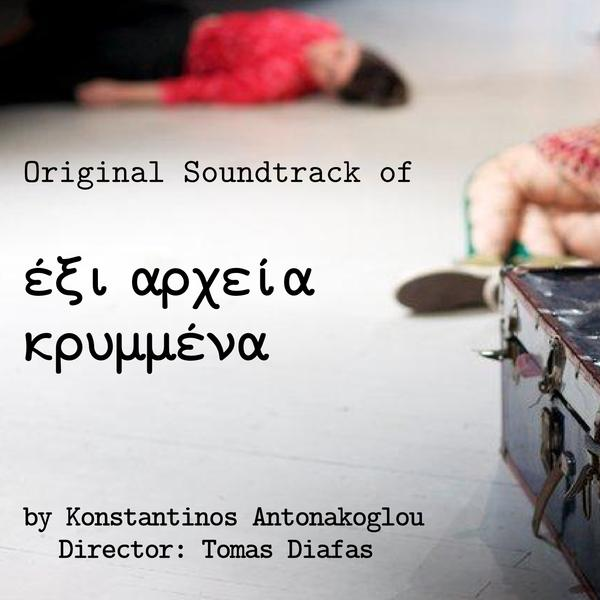

Dear all,

I am glad to announce that I just published my new work. It’s a soundtrack for a theatrical play named “[Έξι αρχεία κρυμμένα](http://www.jamendo.com/en/album/86230)”  that means “six hidden files”. No it has nothing to do with Linux and you can’t unhide them with control+H.

As I already said, this album contains all the songs and effects used at the theatrical play of Tomas Diafas “six hidden files”. Six roles, six hidden documents. This play is inspired from last year’s incidents at the center of Athens, showing a different chain of events and personal misfortunes created from a protest. A theatrical play for the protests around us that reveal the protests inside us.

Download it in OGG format : [http://bit.ly/fpaFbU](http://bit.ly/fpaFbU "Get the album in OGG format")

click to listen the album on Jamendo

\===== Ελληνικά / Greek =====

Τα κομμάτια αυτά γράφτηκαν για τη παράσταση “[Έξι αρχεία κρυμμένα](http://www.jamendo.com/en/album/86230)” του σκηνοθέτη-συγγραφέα Θωμά Διάφα με πρωταγωνιστές έξι χαρακτήρες, έξι αρχεία κρυμμένα, εμπνευσμένη από τα περσυνά τραγικά επεισόδια στο κέντρο της Αθήνας και για το πως αυτά δημιουργούν μια αλληλουχία άλλου είδους προσωπικών επεισοδίων. Μια παράσταση για τις διαδηλώσεις γύρω μας που μαρτυρούν τις επαναστάσεις μέσα μας.Περισσότερες πληροφορίες:  [http://bit.ly/hp1OBC](http://bit.ly/hp1OBC)

Ηθοποιοί:  
Περικλής Ασημακόπουλος  
Έφη Κατσαφάρου  
Ελευθερία Κατσούπη  
Νάντια Παυλάκη  
Βασιλική Σκρέκου  
Απόστολος Φράγκος

Σκηνοθεσία- Κείμενο: Θωμάς Διάφας  
Σκηνικά – Κοστούμια: Δομνίκη Βασιαγεώργη  
Επιμέλεια Κίνησης: Αφροδίτη Βερβενιώτη  
Μουσική: Κωνσταντίνος Αντωνάκογλου  
Βοηθός σκηνοθέτη: Αθανασία Ανδρώνη  
Κομμώσεις- Μακιγιάζ: Καίτη Αραβαντινού
