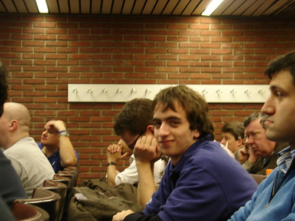
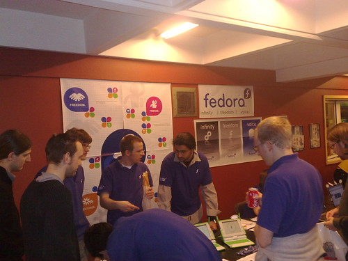

The previous weekend was exciting and fun. I was at FOSDEM 2009 at Brussels (of course), not just to attend the various talks, but also to be present as a Fedora Ambassador at the Fedora booth. There are lot’s of names to mention, as the main benefit from such events is that you get to know people who always have something interesting to say.There is always more knowledge to gain.

More about my experience at the booth. As you may see in various photos of the booth, we had a lot of swag. Many of that stuff  (Fedora flyers, FEL flyers, buttons) were brought by the greek Fedora Ambassadors who attended the event, which is [Pierros Papadeas](http://digitaurora.blogspot.com/) (he really deserves most of the credit) and myself. No, I didn’t forget of Dimitris Glezos who was busy due to his Fedora and Indifex related plans!

Friday

Well, after a pleasant flight with Olympic Airlines, 6 greek open source guys were ready for action in Brussels. I couldn’t wait for the beer event which, eventually, was awesome. The Delirium Cafe was full of people. Most of the time (except when I had go and buy me a beer) I spent it on the outside talking with folks. Anyway, that’s what many other people did. The place was crowded 🙂

Saturday

We tried to get to FOSDEM  as soon as possible with the addition of 3 greek guys we expected.  The booth was already set up. We placed the swag we brought. Our laptops were ready for people who wanted to try Fedora 10.

Most of the questions people had was about the OLPCs and the Sugar interface, but we did the best we could to promote Fedora to future contributors. Time went by and I couldn’t miss the chance to attend the RPM Packaging talk of [Christoph Wickert](http://fedoraproject.org/wiki/ChristophWickert), nor the [Fedora Electronic Lab talk](http://clunixchit.blogspot.com/2009/02/report-fel-fosdem-2009.html) of Chitlesh Goorah. Both were great (you may see for your self at the links).

Me at the Fedora DevRoom

To be honest, at the FEL talk I got my self embarrassed. Something really funny happened. During his talk Chitlesh asked “Who doesn’t know what a LiveCD is?”. Instead of that I heard, “Who knows what a LiveCD is”. And guess what, I raised my hand and , of course, I was the only one. I explained immediately that I didn’t understand the question. The irony is that, as a Fedora Ambassador, I give hundreds of these cds and as a Linux user, there was no chance I wouldn’t have used one 😛 .

So, later on I was present at [Max Spevack’s speech](http://spevack.livejournal.com/74638.html). I really liked the way he got his points clear with the “Red Hat employee” vs “Fedora contributor” approach, using (or not using) a Red fedora. Unfortunately, I couldn’t be there all the time. I had to return to the booth.

Oh yeah! I also got my Fedora Ambassadors shirt (thanks to [Joerg Simon](http://fedoraproject.org/wiki/JoergSimon)). Plus, I couldn’t resist not getting some of the Mozilla buttons and other swag, a FOSDEM and a GNOME t-shirt.

The night was interesting as well. Most of the Fedora guys , we went to another beer cafe. Chitlesh recommended a Kwak. Great beer, strange glass (the next morning I got my self one of those glasses). We had an interesting discussion about lots of things concerning Fedora.

Sunday

The Fedora booth

An other day with lots to happen and lots to do. The combination of booth attendance + interesting talks was a bit tiring but I love to get tired this way. I attended the key-signing party which took place outside the building. It was freezing but we got the job done. There, I met a Spanish Debian guy. I tried to talk a little spanish, but after he started talking I couldn’t understand a thing. Lucky me he translated. I also went to the MediaWiki talk and  to the “Ruby and Java” talk, so I could get to know Ruby a little better.

When the night came, we went to the Delirium Cafe for once more (I could spend a year there).

Pierros, George and me spent Monday for exploring a little bit of Brussels.

Overall, a fantastic experience. Even more pictures [here!](http://www.flickr.com/photos/33074163@N05/sets/72157613576435131/)
