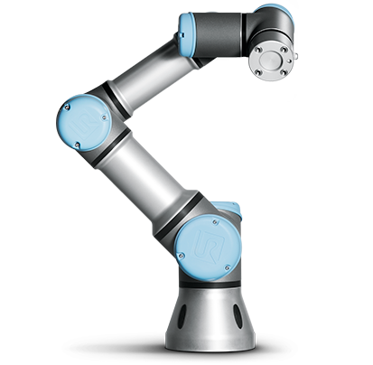

Hello everyone!

Thankfully, it didn’t take me a year to write a 2nd post! This time it’s about a part of a project I worked on the last 2-3 months (in parallel to my PhD studies of course :P). The topic is again teleoperation, this time only using hardware (last [post](http://localhost/wordpress/delayed-teleoperation-demo/) was about using a virtual environment) such as the UR3 robotic arm below (looks great doesn’t it?).

The project I contributed to was demonstrated in Mobile World Congress 2017 in Barcelona at one of the booths of Ericsson. Why Ericsson? Because King’s College London (where I study) and Ericsson collaborate on standardizing 5G. I must say it was a pleasure working with everyone who participated.

Needless to say it was a really tiring week as the event hit a record of 108,000 visitors, but what an experience it was…just epic! I also had the chance to meet and discuss with many interesting and amazing people. For more information there is a [CNET article](https://www.cnet.com/uk/news/5g-not-just-speed-fifth-generation-wireless-tech-lets-you-do-vr-self-driving-cars-drones-remote/) with a bit of a demonstration as well 🙂

Anyway…with the amount of time I had available to learn how to use ROS etc and make the robot move, I could only create a gesture system that receives position commands from a client. The positions the robot could move were pre-defined. I wish I had more time to make a direct control application (with speed and range of motion limiters of course).

### The juice

You can download the Python script [here](https://github.com/constanton/UR3overNet). So…to make the robot move we used Linux (Ubuntu 14.04 specifically) with [ROS](http://www.ros.org/). I said “we” because ROS was not used only for making the robot move. Anyhow, to make the app run you need to:

1.  Create a [catkin workspace](http://wiki.ros.org/catkin/Tutorials/create_a_workspace) using ROS.
2.  Download the ROS-Industrial [universal robot meta-package](https://github.com/ros-industrial/universal_robot).
3.  Download [ur\_modern\_driver](https://github.com/ThomasTimm/ur_modern_driver) and put everything inside the workspace’s src folder.
4.  Compile with catkin\_make (yes, you will probably need to install many ROS dependencies).
5.  And then open a terminal to launch ROS with:  

    > $ source _path/to/workspace_/devel/setup.sh
    > 
    > $ roslaunch ur\_bringup ur3\_bringup.launch robot\_ip:=xxx.xxx.xxx.xxx (apply the correct robot IP)

6.  Open another terminal to run the application:  

    > $ source _path/to/workspace_/devel/setup.sh
    > 
    > $ rosrun ur\_modern\_driver network\_move.py

Again, as with my previous post…not sure if this is helpful to anyone but it’s good to have it documented somewhere 🙂
