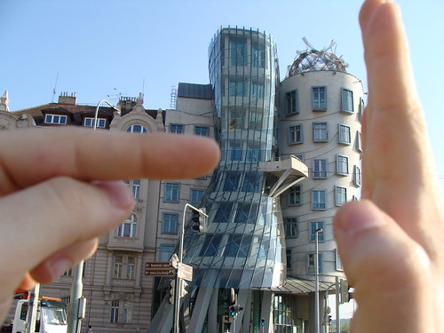

Hello everyone,

As you may have noticed from the title of the post I have set foot in Czech Republic since Saturday. I am having really good time, met many people (ok not as many as possible :P) and seen many beautiful places, monuments and buildings. I almost forgot to mention the beers :P. Can’t wait to make the of best of it as long as I’ll stay here. I’m staying at [Hradec Králové](http://en.wikipedia.org/wiki/Hradec_Kralove_Region "Hradec Kralove Region") at a friend’s house who studies Pharmacy here.

Saturday – Not much to do. Plain landed at 6 p.m. Took the bus to Mustek and then went to [Hlavní Nádraží](http://en.wikipedia.org/wiki/Praha_hlavn%C3%AD_n%C3%A1dra%C5%BE%C3%AD) to get to Hradec Kralove by train (1,5 hour distance). Later on we went to a bar (had beer and a [Long island iced tea](http://en.wikipedia.org/wiki/Long_Island_Iced_Tea_\(cocktail\)) and stayed till after midnight.

Sunday – Had a walk at Hradec Králové. Went at the center of the city, walked by one the two rivers running through the city (walked through bridges, visited parks, statues, squares etc)

Monday –  Took the train to go back to Prague. I really enjoyed the view of the countryside. Finally at Prague, what a beautiful city. The streets, the buildings, the people. Lots of tourists. I feel like the city is on the move but I not in front of my eyes. I guess that means I am really on vacation. I went to a Torture instruments museum. Freaky , huh?

But the best part of Monday was that I went to the roof of the [Dancing House](http://en.wikipedia.org/wiki/Dancing_House) at Praha 2:

  

Tuesday – As busy as Monday. Went to [Prague Castle](http://en.wikipedia.org/wiki/Prague_Castle) and had a walk around the area. The view from up there is beautiful. Unfortunately, we had to leave to Hradec Kralove.  

Wednesday – Just a break from my holidays to make new plans, charge batteries ( litteraly and metaphorically), relax and go back to Prague tomorrow. Oups!  I’ts Thursday allready. There’s a lot I did but didn’t mention.  Got to go though…2 days left.

[View from Charle's Bridge (image unavailable)](http://www.flickr.com/photos/33074163@N05/3444786461/)Me at the [Charle’s Bridge](http://en.wikipedia.org/wiki/Charles_Bridge)
