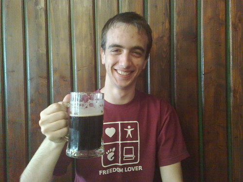

Hi again,

I’m back to Greece. No more vacations 😦 . Fortunately, I had really good time 🙂 .

Both Thursday and Friday were spent in Prague. I need to mention that on Thursday I had lunch at [U Fleku](http://www.ufleku.cz/en/index.php). I had a goulash and 2 glasses of “U Fleků” beer which was just perfect!

Friday went a lot better than I had predicted due to the rainny weather. I had an espresso at the Prague Castle area and afterwards I visited the [GIGABYTE Open Overclocking Championship](http://e-pcmag.gr/news/58650) and cheered for the greek team. The view from the 24th floor of the [Corinthia Hotel](http://prague.corinthia.cz/hotel/en/hotel-location/) was astonishing.

Freedom & Beer Lover
