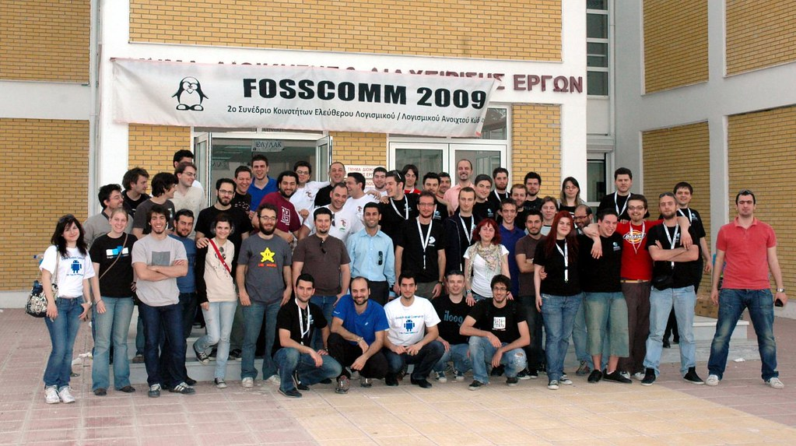

Friday 8/5 was  quite a busy day. After I finished my courses  etc. and once again I headed for home through the hell that has been renamed to “national road” at mid-day (all thanks to my fellow Greeks who crash their cars every now and then).  Anyhow, when I finally arrived home I picked up my Fedora and FEL ([Fedora Electronic Lab](http://chitlesh.fedorapeople.org/FEL/))  leaflets, my laptop and everything else I needed to go to [FossComm 2009](http://larisa.fosscomm.gr/) along with Pierros and friends.

Well, the trip was fine and we had a stop at Volos for a bit greek meze and a little bit of tsipouro. Afterwards we went to Larissa , got to the Hotel and relaxed in our rooms. I also met there my friend Alexandros. Anyways, Friday was not as interesting as Saturday.

Next morning we were at the TEI of Larissa to prepare our booth for Fedora for the whole event (along with [Christos Bacharakis](http://bacharakis.com/), Thalia Papoutsaki and Pierros) ! We unpacked everything, from fliers to OLPC, plus I had my laptop to show some programs on FEL. All guys there did a great job organizing the event. The atmosphere was relaxing and also exciting.

I can’t describe how the night went. Α word that could describe most of the people that attended the feast at the tsipouradiko (tavern with lots of tsipouro and greek meze dishes) would be “kurumpelo” which means drunk, but I believe we were more or less drunk but very joyful and in a great mood for company. (But seriously, I have no idea how the guy with the bicycle ended up safe at his house…)

FossComm attendies, presenters, organizers etc all together 🙂

Now, let’s talk about Sunday 🙂 .  [Pierros Papadeas](http://pierros.papadeas.gr/) ‘s presentation on the Fedora project went really well! He really made clear of the goals, the people that support it, explained the four foundations etc…It was cool. [Dimitris Glezos](http://dimitris.glezos.com/en/) presented [Transifex](http://www.transifex.org/). For those who don’t already know, it’s an open source project, a localization web platform already used by the Fedora Project (Dimitris is a member of th Fedora Board!) and Red Hat, developed by Dimitris and the rest of  [Indifex](http://www.indifex.com) ‘s (yeap, his company) engineers team.

My presentation on [FEL](http://chitlesh.fedorapeople.org/FEL/) went quite good. It happened during our [Fedora 11 Hackfest](http://fedoraproject.gr/2009/05/05/fosscomm-2009-fedora-11-hackfest/). I had to point out the goals of FEL, some interesting features that has and that will have (thanks [Chitlesh](http://clunixchit.blogspot.com/)!). I also presented some very interesting tools for design and simulation of circuits. I also mentioned the advantages of FEL, live every other Spin of Fedora has. It was my first presentation and the audience was not very into electronics (except to 2 out of 20-25 people). I had to try not to become boring, so I had to make changes instantly to what I previously prepared to say. Not the best feeling but at the end it was fun and I gained a great experience.

On Monday the Fedora 11 Hackfest continued but I was absent due to a lab at my school I had to attend.

For even more interesting photos and videos —-> [FTP Server](ftp://linuxteam.cs.teilar.gr/fosscomm/) of Linux Team

I’m glad this post is over because there’s a lot more that I have to post. Busy week, busy month, busy year…

[My self at FossComm 2009 - FEL presentation (image unavailable)](http://dimitris.glezos.com/photos/main.php?g2_view=core.DownloadItem&g2_itemId=7627&g2_serialNumber=2)

My self at FossComm 2009 - FEL presentation
