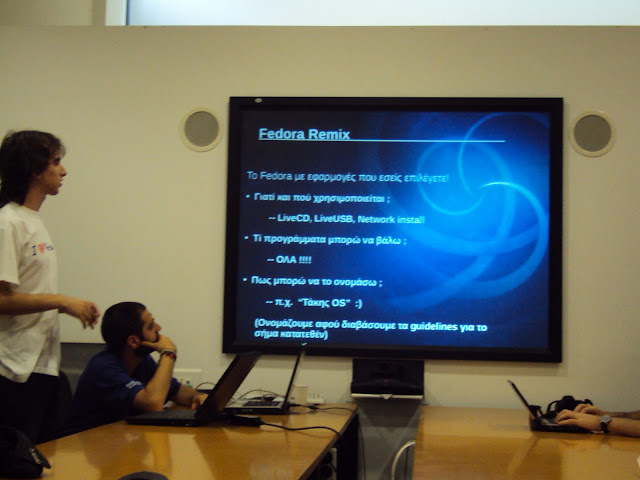

Yesterday ended the GFOSS Conference 2010 that took place in Athens at NTUA (National Technical University of Athens). It was an event that started on Friday, but yesterday was special because of the workshop I was organising this week together with Anastasis (anast)! The subject was (in translation) “Fedora Project : Remix and Spin it! The Fedora operating system you own (and not only that)”. Furthermore, we also had booth presence on both days with the usual swag 🙂

The workshop lasted 1 hour ( the schedule said 2 hours) but I think something more than that would be boring. Some setbacks occurred previously that day and affected the workshop a little bit. First, I tried to create an iso image using a kicksart file I made that unfortunately needed a bit of time to be created due to yesterday’s bad signal of the wifi where the booth of Fedora was (damn near fields), so I didn’t make it in time for the “Takis OS” Live CD I wanted to create. Second, I didn’t expect my laptop to fail me when I tried to plug in the dvi cable. I count it as a setback but, ok I overcame it thanks to the laptop of Anastasis 🙂

I think it was around 15 people that joined the workshop (thanks to everybody). I tried to pass the knowledge of what is a remix, a spin, their differences (and similarities), guidelines, processes, kickstart files, livecd-tools, cobbler…but not to the extent of getting down with too much coding, configurations and setting many arameters. In a few words I tried to show the way for a simple creation of a Remix from the kickstart file until the creation of a LiveCD and told a few words about the magic things cobbler can do. Anastasis talked about Geo Spin and Security Lab spin. I couldn’t miss the chance to talk about Fedora Electronic Lab too. Also, I am happy that Nikos (comzeradd) and Pantelis (pant) joined us as well!

click for more photos
