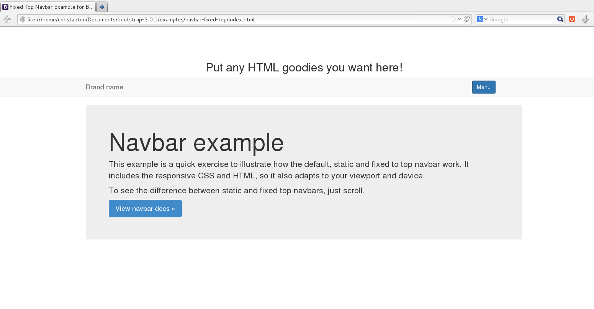

Hi, as you might have noticed [Sopler](http://sopler.net "Sopler") has a navigation menu very similar to that of [Mozilla’s Tabzilla](http://code.debs.io/tabzilla/ "Mozilla's Tabzilla")…but it’s not 🙂

I think Tabzilla is a great tool but while making Sopler’s front-end with [Bootstrap](http://getbootstrap.com/ "Bootstrap") I faced a problem integrating it. I had to use a string in order to place HTML inside my menu. That’ss very restrictive. But, I found a similarity between a component of Bootstrap and Tabzilla!

I have no idea if someone else has found that out too, but it’s  the same effect with Bootstrap’s [accordion](http://getbootstrap.com/javascript/#collapse "Bootstrap's accordion"). It expands & retracts.

In this post I will use the template of the **navbar-fixed-top** example from Bootstrap 3. Go get it [here](http://getbootstrap.com/ "Bootstrap 3") (Download source). It’s in the **examples** folder. Tabzilla is not fixed so I think we have an improvement here. Anyway, someone might find it too much, so, to implement my example on the _navbar-static-top_, you won’t need the javascript code at the end of this post. Here is a **demo** for **navbar-static-top** (not the navbar-fixed-top I mentioned before): [http://jsbin.com/EkAweqA/1/](http://jsbin.com/EkAweqA/1/ "Example on jsbin.com") (press the _Menu_ button)

The whole trick is to place the “accordion-body” div above the “accordion-heading” and then write a few lines of Javascript to change the navbar’s position from fixed to relative….and that’s it!

Go to the **navbar-fixed-top** example, open index.html and replace everything **between**:

```xml
<!-- Fixed navbar -->
```

and

```xml
<div class="container">

<!-- Main component for a primary marketing message or call to action -->
```

(this is **NOT** the first div class=”container”  you’ll find, it’s the one in line 69)

```xml
<!--- This will not show up until you press the Menu button --->
<div id="login_box" class="login-box">
   <div class="accordion" id="accordion2">
      <div class="accordion-group">
         <div id="collapsemenu" class="accordion-body collapse">
            <div class="accordion-inner">
		    <div class="row inner_box">
			<div class="col-md-12">
			    <h2>Put any HTML goodies you want here!</h2>
			</div>
		    </div>
	    </div>
         </div>
      </div>
   </div>
</div>

     <!-- Fixed navbar (To make it static simply change to navbar-static-top)-->
    <div class="navbar navbar-default navbar-fixed-top">
      <div class="container">
         <ul  class="nav navbar-nav list-inline" style="float:right; margin-right: 5em; white-space: nowrap;">
   	<div class="accordion-heading">
        </div>
	 <button type="button" id="menu_button" class="btn btn-primary navbar-btn" data-toggle="collapse" data-parent="#accordion2" href="#collapsemenu">Menu</button>
</ul>
	<a  class="navbar-brand" href="#">Brand name</a>
      </div>

    </div>
```

Now, we need to create two more classes at the navbar-fixed-top.css (it’s next to index.html inside the navbar-fixed-top folder) :

```css
.login-box{
white-space:nowrap;
top:0;
width:100%;
background:#fff;
overflow: hidden;

}

.inner_box{
margin:0 auto; max-width:57em; text-align:center;
}
```

Of course you can style it the way you want! And finally let’s go to the footer of the page (under the jquery.js call) and put this script (not useful for the navbar-static-example):

```javascript
<script type="text/javascript">
$(document).ready(function(){
var isopen="";
$('#menu_button').click(function(){
if (!open){
$('.navbar-fixed-top').css('position','relative');
$('html,body').animate({ scrollTop: 0 }, 'normal');
}else{
$('.navbar-fixed-top').css('position','fixed');
}
isopen=!isopen;
});
});
</script>
```

Let’s explain the script! We use the _isopen_ variable (line 3) which is set to false by default. It’s working like a switch. If the menu is not open and we click the Menu button then the page scrolls to the top and the position of the bar is set to relative. If we click the button again then the navbar’s position is se to fixed. We don’t need to scroll because when the menu is open the bar won’t move from its place anyway (that’s why we used relative).

If all goes well, when you click the Menu button it should look like that:


