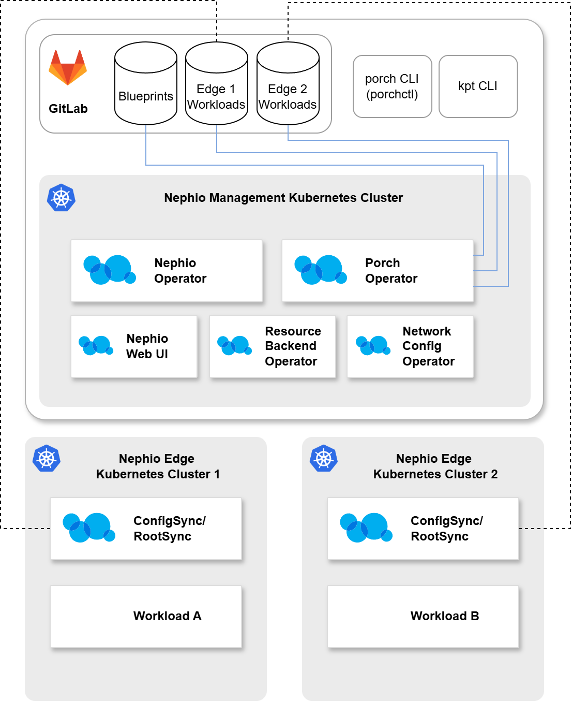

I recently wrote a tutorial regarding an open source platform for automated cloud-native service management and orchestration. It’s the Linux Foundation project Nephio. You can read about [how to deploy it here](https://medium.com/@DigiCatapult/nephio-tutorial-setting-up-nephio-management-and-workload-clusters-aba05fce603e).

Hopefully, I will write a second part that details how we have used Nephio’s CRs and extended it’s capabilities so far. Still experimenting with this very interesting platform.

Diagram of an example Nephio deployment.
