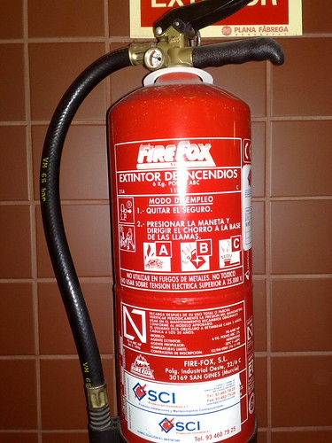

Almost a month here in Barcelona (in 4 days to be precise!)…Anyway, I will be quick. In a previous post there is an picture of a fire extinguisher called “UNIX”. On this post, let me show you my new find!Yes, another fire extinguisher…I think someone is doing this to me on purpose!  
Yeah, it says “FIREFOX”…it’s cooler than Unix as it’s open source…but I like them both (?). Anyway. If I find a third one, I’ll let you all know. A friend of mine told me that I should find matchboxes with names like “Apple” or “MS” etc (yes this illustrates an obvious point). I don’t want to find anything of these, they just come to me! Hahaha…
