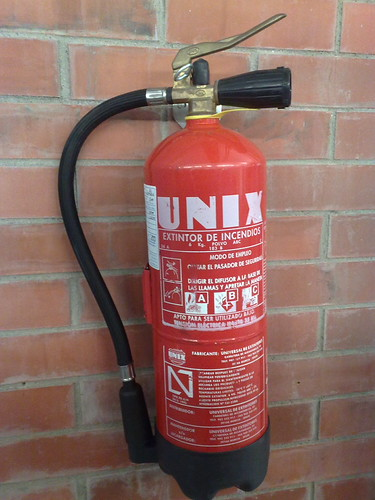

Not much to say about it…I saw it here at FIB (Facultat de Informatica de Barcelona) at the UPC. OK! It’s a faculty of Informatics…not so unexpected maybe!!! I hope they will upgrade to Linux! hahaha

(Imagine a scene with a trapped person inside the building using the fire extinguisher (yes the UNIX one) to brake a window(s)…quite cool picture eh? hahaha)
