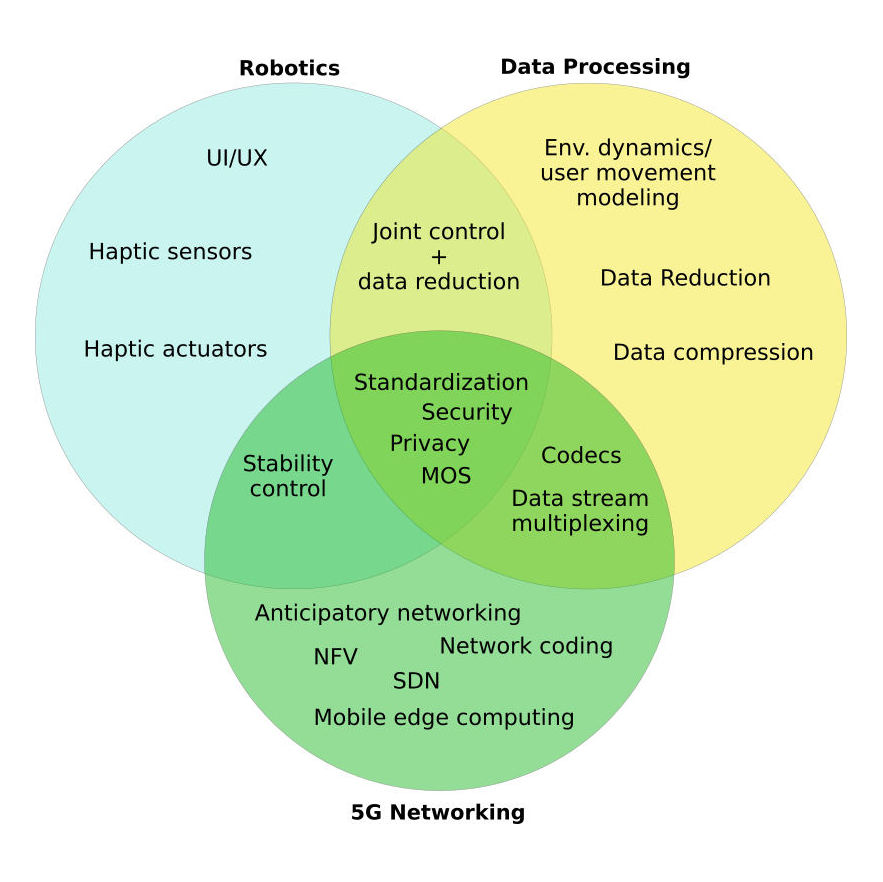

Hello everyone,

This is my first post for 2018 (hooray!) and hopefully not the only one. I am writing this blogpost because a paper in which I was a leading author (together with some amazing co-authors) recently got published on IEEE Communications Surveys & Tutorials (IEEE COMST). Yes, it is a survey paper, it took me a really long time to write it and that’s why it needs a special blog post.

The paper is called “Towards Haptic Communications over the 5G Tactile Internet” and is a survey on the most important technologies and methodologies that will allow teleoperation with haptic feedback over 5G networks to become reality in the future.

One thing I found difficult when writing this paper was that because the topic is multidisciplinary, I had to find the correct balance to mix “all the cuisines in a single plate” (thanks [Aravindh](https://twitter.com/_aravindh/status/992352359182454784)!). I had to satisfy the COMST audience, mostly interested in the 5G networking aspect, but also mention important aspects and challenges of bilateral control systems theory and haptic data processing.

All cuisines in a single plate

You can either download a pre-print version of the paper [here](https://kclpure.kcl.ac.uk/portal/en/publications/towards-haptic-communications-over-the-5g-tactile-internet\(b1e19f4b-6b8c-4365-9810-66e8644edbd6\).html) (link is under “Documents” section), or you can visit [IEEE Xplore](https://ieeexplore.ieee.org/document/8399482/) if you have access.  Same thing basically.

Last but not least, many special thanks to all co-authors for their valuable contributions, help and support, but, also to the IEEE COMST anonymous reviewers for their suggestions that really helped in improving the manuscript.
